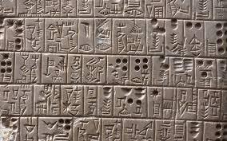
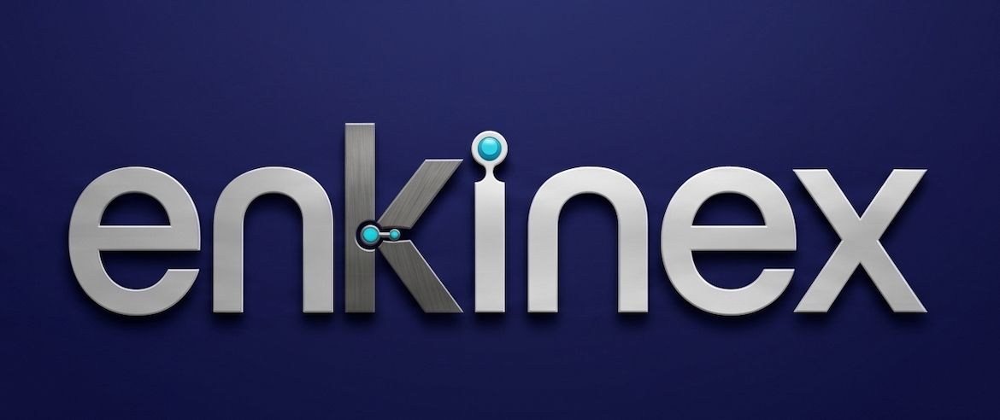
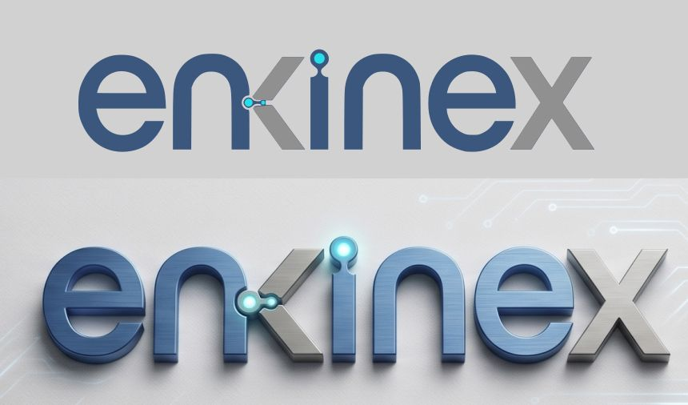
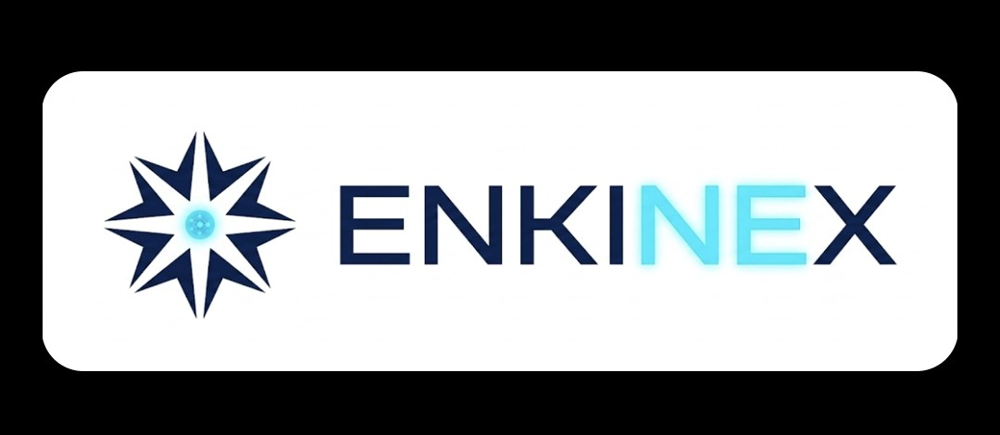
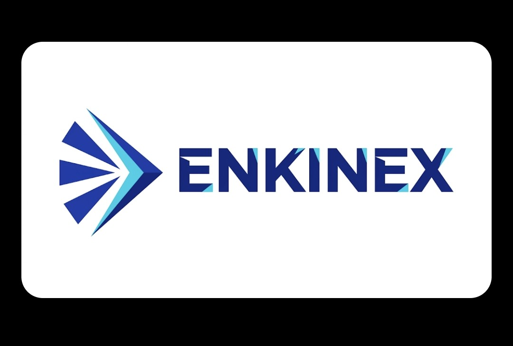
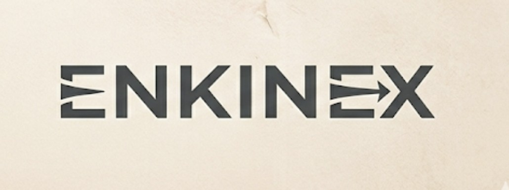
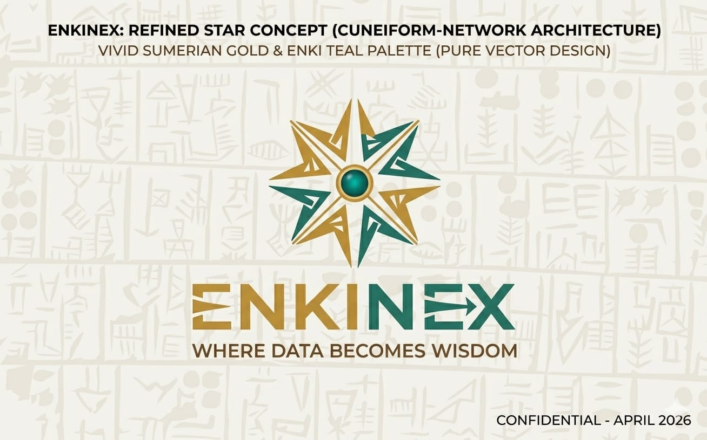

# ENKINEX — Brand Identity Briefing

*Where Data Becomes Wisdom*

**For Logo Design & Visual Identity Development**
April 2026 • Confidential

---

## 1. Company Overview

### What Enkinex Does

Enkinex is a Brazilian consulting company that designs, builds, and implements custom modern data and AI platforms. We
help organizations transform raw data into structured intelligence, enabling better decision-making through data
governance, analytics, and artificial intelligence solutions.

### Core Services

- **Custom Data Platform Development:** End-to-end architecture, engineering, and deployment of modern data platforms
  tailored to each organization's needs.
- **AI & Machine Learning Solutions:** Design and implementation of AI-powered tools for prediction, automation, natural
  language processing, and intelligent decision support.
- **Data Governance & Strategy:** Frameworks for data quality, compliance, security, and organizational data maturity.
- **Consulting & Advisory:** Strategic guidance for digital transformation, data-driven culture, and technology
  modernization.

### Target Market

**Private:** Mid-to-large private enterprises across industries requiring sophisticated data platforms and governance
frameworks.

**Public:** Government entities and public sector organizations in Brazil seeking to modernize their data
infrastructure and adopt AI.

### Legal & Digital Presence

- **Legal name:** Enkinex Data Ltda. Trade name: Enkinex.
- **Primary domain:** enkinex.com
- **Secondary domain:** enkinex.ai *(for product or AI-specific communications)*

---

## 2. Brand Name: Origin & Meaning

### Etymology

The name **Enkinex** is a compound of two meaningful roots:

- **ENKI:** The Sumerian god of wisdom, knowledge, water, creation, and intelligence. In Sumerian mythology, Enki was
  the deity who organized the world through knowledge — he assigned roles, structured information, and brought order to
  chaos. He is considered the architect of civilization.
- **NEX:** Derived from three interconnected concepts: *Nexus* (a connection point, a hub where things converge),
  *Next* (forward-looking, innovative, what comes after), and the original vision of the company, which aimed to serve
  governance as a core feature.

Together, **Enkinex** means: *ancient wisdom applied to the next frontier of data and intelligence.*

### The Sumerian Connection

The choice of Sumerian mythology is not arbitrary. The Sumerian civilization (c. 4500–1900 BCE, in modern-day Iraq) is
directly relevant to what Enkinex does:

- **Cuneiform Writing:** The Sumerians invented the first writing system — cuneiform — which was humanity's first data
  technology. They pressed wedge-shaped marks into clay tablets to record information, creating the earliest structured
  data.
- **City-States & Governance:** The Sumerians invented the concept of the city-state, pioneering governance,
  administrative records, census data, tax systems, and public administration — all of which are among the sectors
  Enkinex serves.
- **Enki as Architect:** Enki did not simply possess wisdom — he applied it to organize the world. This mirrors
  Enkinex's approach: we do not just consult, we build.

### The Brand Story

> *"Five thousand years ago, the Sumerians invented writing, built the first cities, and organized the world through
knowledge. Their god of wisdom, Enki, was the architect of it all — turning chaos into structure, raw information into
actionable understanding. Enkinex carries that spirit forward. We build the platforms that transform your organization's
data into wisdom — structured, governed, and ready to power decisions. From the civilization that invented data to the
platforms that master it."*

### Phonetic Appeal

Enkinex *(en-ki-nex)* shares a subtle phonetic similarity with NGINX *(en-gi-nex)*, one of the most recognized names in
technology infrastructure. This creates unconscious sonic familiarity — the name instinctively "sounds like technology"
to decision-makers without any visual or semantic confusion. The spelling, meaning, and market positioning are entirely
distinct.

---

## 3. Brand Personality & Positioning

### Brand Archetype: The Sage-Builder

Enkinex combines the wisdom of the **Sage** archetype (knowledge, insight, strategic thinking) with the hands-on
capability of the **Builder** (we create, engineer, and deliver tangible platforms). We are not a company that only
advises — we build. But we do not build blindly — everything is guided by deep understanding and strategic intelligence.

### Brand Personality Traits

| Trait             | Expression                                                                                    |
|-------------------|-----------------------------------------------------------------------------------------------|
| **Authoritative** | We speak from deep expertise. Our brand conveys trust and competence without arrogance.       |
| **Innovative**    | We are forward-looking and modern in our approach. We bring cutting-edge technology.          |
| **Structured**    | We bring order to complexity. Our visual language should reflect clarity and precision.       |
| **Warm**          | Despite being technical, we are approachable and human. We listen, understand, then build.    |
| **Enduring**      | Rooted in 5,000 years of knowledge tradition, we are not a trend. We are a long-term partner. |
| **Brazilian**     | We are proudly based in Brazil, serving Brazilian organizations first, with global ambition.  |

### Brand Voice

- **Tone:** Confident but not boastful. Technical but not cold. Strategic but not detached.
- **Language:** Clear, precise, and action-oriented. We avoid buzzwords and jargon. When we use technical terms, we do
  so with purpose.
- **Perspective:** We speak as trusted advisors who also get their hands dirty. We are not ivory tower consultants.

### Positioning Statement

> *"Enkinex is the data and AI consultancy that builds intelligent platforms for organizations ready to turn information
into their most powerful strategic asset."*

### Tagline Options

- *Where data becomes wisdom*
- *Organizing the world through intelligence*
- *The architecture of insight*
- *Ancient wisdom. Modern platforms.*

---

## 4. Visual Identity Direction

### Design Philosophy

The visual identity should feel like it belongs to a premium technology consultancy with unusual depth. It should not
look like a generic SaaS startup *(avoid gradients, rounded-everything, bright purple/blue palettes)*. It should not
look like an ancient history museum either. The goal is a modern, authoritative brand that reveals its Sumerian roots
subtly — as an Easter egg that rewards curiosity, not as a costume.

### Logo Direction

The logo should work in three configurations:

- **Logomark (Icon):** A standalone symbol that can be used as a favicon, app icon, or social media avatar. Should be
  recognizable at small sizes (16px–32px).
- **Logotype (Wordmark):** The word ENKINEX in a custom or carefully selected typeface. Consider whether ENKI and NEX
  should be visually distinguished (e.g., weight change, color shift, subtle separation) to reinforce the two meaningful
  roots.
- **Lockup (Icon + Wordmark):** The primary brand signature combining both elements. Should work horizontally and, if
  possible, in a stacked vertical arrangement.

### Sumerian Visual Elements to Explore

The designer is encouraged to draw inspiration from Sumerian art and writing, but always abstracting and modernizing.
Literal representations should be avoided.

- **Cuneiform Wedge Marks:** The triangular, wedge-shaped impressions made by a reed stylus on clay tablets. These could
  inspire letterforms (particularly the E), geometric patterns, or texture elements. The wedge shape carries a powerful
  metaphor: the act of pressing structured marks into raw material is exactly what Enkinex does with data.
- **The Star of Enki:** In Sumerian iconography, Enki is associated with an eight-pointed star symbol. This could be
  abstracted into a node-and-connection diagram, a compass rose, or a radial pattern suggesting intelligence emanating
  from a central point.
- **Clay Tablet Grid:** Sumerian tablets were organized in structured grids and columns — the first "spreadsheets." This
  grid structure could inform layout patterns, secondary graphic elements, or background textures.
- **Water Imagery:** Enki was the god of freshwater (the Abzu). Water represents the flow of data, fluidity,
  transformation, and clarity. Subtle wave or flow patterns could complement the more geometric Sumerian elements.
- **Ziggurat (Stepped Pyramid):** The Sumerian ziggurat represents ascending layers — from raw data at the base to
  wisdom at the peak. This could inspire a stacked or layered logomark, or an icon representing data platform
  architecture.

### What to Avoid in the Logo

- Literal Sumerian imagery (no cuneiform text, no ancient figures, no museum-style illustrations)
- Generic tech clichés (no circuit boards, no binary code, no robot heads, no brain illustrations)
- Overly complex marks that lose legibility at small sizes
- Trendy design that will age quickly (avoid extreme gradients, 3D effects, or hyper-glossy styles)
- Designs that feel cold or impersonal — this brand has warmth and soul

---

## 5. Color Palette

The following palette is rooted in the brand story. The designer may refine, adjust, or expand it, but the emotional
territory should remain: warm gold, deep authority, natural wisdom.

| Color             | Hex       | Role & Meaning                                                                                                                                      |
|-------------------|-----------|-----------------------------------------------------------------------------------------------------------------------------------------------------|
| **Sumerian Gold** | `#C4953A` | Primary accent. Evokes cuneiform tablets in golden light, authority, warmth, and premium quality. Used for highlights, CTAs, and key brand moments. |
| **Tablet Dark**   | `#1A1A2E` | Primary dark tone. Deep, almost-black blue. Used for text, dark backgrounds, and to convey depth and authority. Not pure black — has warmth.        |
| **Enki Teal**     | `#2A7A6A` | Secondary accent. Represents Enki's connection to water (the Abzu). Conveys innovation, clarity, and technology. Complements the gold.              |
| **Clay Light**    | `#F5F2EB` | Light background. Warm off-white inspired by the color of dried clay tablets. Avoids the sterility of pure white. Used for page backgrounds.        |
| **Reed Brown**    | `#8B7355` | Tertiary / neutral warm. The color of the reed stylus used to write cuneiform. Used for subtle accents, borders, and secondary text.                |

> **Note:** These colors are a brand-story-driven starting point. The designer has creative freedom to refine exact
> values while preserving the emotional direction: warm authority (gold), deep intelligence (dark navy), and innovative
> clarity (teal). An alternative direction using navy and cyan blues is also valid if it better serves the final design.

---

## 6. Typography Direction

The typography should balance authority with modernity.

- **Display / Logo Font:** A geometric sans-serif with character, or a refined serif with modern proportions. Consider
  typefaces with sharp, angular details that could echo cuneiform wedge marks. Options to explore: a custom-modified
  geometric sans, a humanist serif for a more consultancy feel, or a hybrid approach where ENKI uses one weight/style
  and NEX uses another.
- **Body / Communications Font:** A clean, highly legible sans-serif for presentations, documents, and digital. Should
  feel contemporary and professional. Avoid anything too playful or too generic.
- **Monospace / Technical:** For code samples, data visualizations, or technical documentation. Should complement the
  brand system.

---

## 7. Brand Applications

The designer should consider how the identity will perform across the following touchpoints:

### Digital

- Website (enkinex.com and enkinex.ai)
- Social media profiles and cover images (LinkedIn as primary channel)
- Email signatures
- Favicon and app icons (must be legible at 16px)

### Business Materials

- Business cards
- Presentation decks / pitch decks (PowerPoint / Google Slides template)
- Proposal and report templates (Word / PDF)
- Invoices and formal documents

### Marketing & Thought Leadership

- Blog post and article social cards
- Case study layouts
- Conference and event branding (banners, badges, roll-ups)
- Branded merchandise (if applicable)

---

## 8. Competitive Visual Landscape

To differentiate effectively, the designer should be aware of common visual patterns in the Brazilian data/AI consulting
market:

**What most competitors look like:** Blue gradients, abstract circuit/network graphics, stock-photo-heavy websites,
generic sans-serif typography, interchangeable visual identities. Many use cold, clinical color schemes that
prioritize "techy" over "trusted."

**Where Enkinex should differentiate:** Warm tones (gold, clay, teal) instead of cold blues. A sense of heritage and
depth instead of trendy startup energy. Angular, purposeful geometry inspired by cuneiform instead of generic
network/node graphics. A brand that feels like it has a soul and a story, not just a service catalog.

---

## 9. Reference Concepts (AI-Generated)

Three initial concept directions were generated using AI tools to explore possibilities. These are **NOT final designs**
and should **NOT be replicated**. They serve only as conversation starters for the designer.

### Concept A — Cuneiform Wordmark

Dark wordmark on a clay/parchment background where the letters E and X feature angular cuneiform-inspired wedge cuts.
Strong typographic approach. Direction: the letterforms themselves tell the Sumerian story.

### Concept B — Eight-Pointed Star

A radial star icon (referencing Enki's star) paired with the wordmark in navy and cyan. The ENKI portion appears in dark
navy while NEX shifts to lighter cyan. Direction: a strong symbol-first identity with color-coded name roots.

### Concept C — Forward Arrow / Chevrons

Layered chevron/arrow shapes in navy and cyan forming a forward-pointing mark beside the wordmark. Direction: emphasizes
forward motion, innovation, and the "next" element of the name.

> The designer is free to explore entirely new directions beyond these three concepts.

---

## 10. Requested Deliverables

### Logo Concept Images

- 
- 
- 
- 
- 
- 

### File Formats

- SVG (vector, primary)
- AI/EPS (editable vector)
- PNG (transparent background, multiple sizes)
- PDF (print-ready)

### Brand Guidelines Mini-Guide

Clear space rules, minimum size, do's and don'ts, approved color usage.

### Additional Deliverables

- **Business Card Design** (front and back)
- **Social Media Kit:** LinkedIn profile picture, LinkedIn banner, and a post template
- **Presentation Template:** PowerPoint or Google Slides master with cover, section divider, content, and closing slides

---

*enkinex.com • enkinex.ai*
*Confidential*